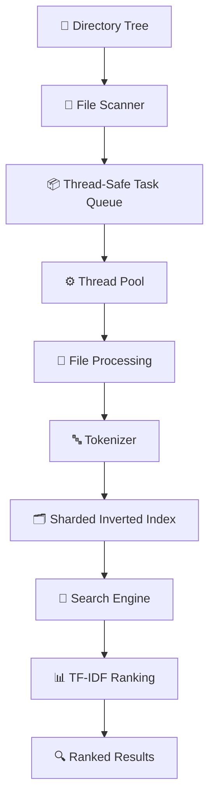
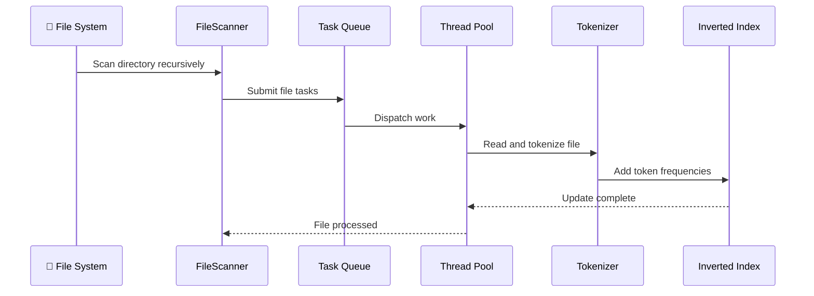
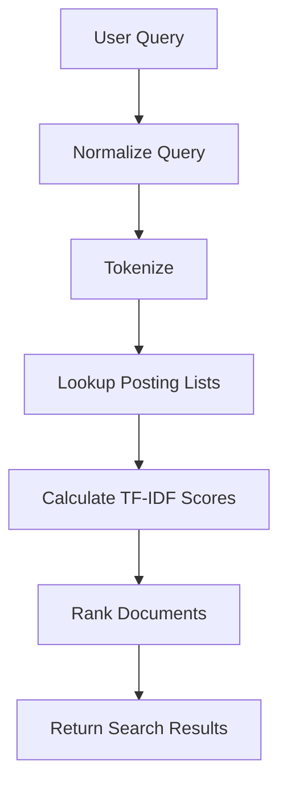
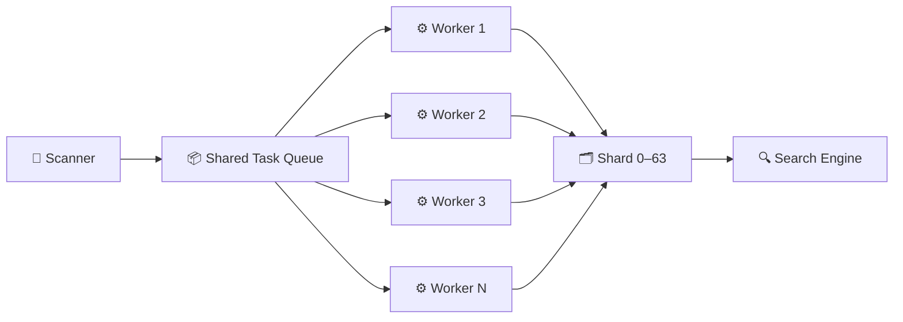

# ⚡ Multithreaded File Search Engine

<p align="center">

**A high-performance C++17 file indexing and search engine built for concurrent workloads.**

Recursively scan directories • Build a sharded inverted index • Search with TF-IDF • Benchmark concurrency • Persist indexes

<br/>

[](https://isocpp.org/)
[](https://cmake.org/)
[](https://github.com/google/googletest)
[](#)
[](LICENSE)

</p>

---

## 📌 Overview

**Multithreaded File Search Engine** is a C++17 command-line search system that recursively indexes files, tokenizes their contents, builds a **64-shard inverted index**, and performs **TF-IDF ranked keyword search**.

The indexing pipeline is designed around concurrent file processing using a custom thread pool and thread-safe task queue.



### What makes it interesting?

* ⚙️ **Concurrent indexing** with configurable worker threads
* 🗂️ **64-shard inverted index** for concurrent access
* 🔎 **TF-IDF-based search ranking**
* 💾 **Binary index persistence**
* 📈 **Concurrency benchmarking**
* 🧪 **GoogleTest-based unit testing**
* 🖥️ **Interactive CLI and direct command-line execution**
* 📝 **Thread-safe application logging**

---

# ✨ Features

<table>
<tr>
<td width="50%">

### ⚙️ Multithreaded Indexing

A configurable custom thread pool distributes file-processing work across multiple worker threads.

```text
Directory
    ↓
Scanner
    ↓
Task Queue
    ↓
Worker Pool
    ↓
Parallel Processing
```

</td>
<td width="50%">

### 🗂️ Sharded Inverted Index

The index is divided into **64 shards**, allowing independent portions of the index to be synchronized separately.

```text
                 Inverted Index
                       │
        ┌──────────────┼──────────────┐
        ↓              ↓              ↓
     Shard 0        Shard 1       ... Shard 63
```

</td>
</tr>

<tr>
<td>

### 🔎 TF-IDF Search

Queries are scored using normalized term frequency and smoothed inverse document frequency.

Results are returned in deterministic ranked order.

</td>
<td>

### 💾 Persistent Indexes

Save the built index to disk and reload it later without rescanning the entire directory tree.

```bash
--save-index index.bin
--load-index index.bin
```

</td>
</tr>

<tr>
<td>

### 📈 Benchmarking

Measure indexing performance across different thread counts.

```text
1 → 2 → 4 → 8 threads
```

Results are exported to:

```text
benchmarks/results.csv
```

</td>
<td>

### 🧪 Automated Testing

GoogleTest covers the major components of the system:

* Tokenizer
* Queue
* Index
* Search
* Scanner
* Persistence

</td>
</tr>
</table>

---

# 🧩 Supported File Types

The scanner currently supports:

```text
.txt   .md     .cpp    .h      .hpp    .c
.py    .java   .json   .csv    .xml    .yaml
.yml   .sh     .bat    .cmake  .rs     .go
.js    .ts     .html   .css    .rb     .swift
.kt    .scala  .pl     .lua    .r      .sql
```

---

# 🏗️ System Architecture

The application follows a pipeline architecture where each stage has a focused responsibility.


## Architecture Layers

| Layer            | Component            | Responsibility                        |
| ---------------- | -------------------- | ------------------------------------- |
| **Input**        | `FileScanner`        | Recursively discovers supported files |
| **Concurrency**  | `ThreadSafeQueue<T>` | Coordinates indexing tasks            |
| **Concurrency**  | `ThreadPool`         | Executes tasks across worker threads  |
| **Processing**   | `Tokenizer`          | Normalizes and filters text           |
| **Storage**      | `InvertedIndex`      | Stores token-to-document mappings     |
| **Search**       | `SearchEngine`       | Scores and ranks documents            |
| **Persistence**  | `IndexManager`       | Saves and loads indexes               |
| **Benchmarking** | `BenchmarkManager`   | Measures concurrency performance      |
| **Diagnostics**  | `Logger`             | Thread-safe application logging       |

---

# 🔄 Indexing Workflow

When a directory is indexed, the following pipeline is executed:



This design separates **file discovery**, **task scheduling**, **text processing**, and **index storage**, making the system easier to reason about and benchmark.

---

# 🔍 Search Workflow



Example:

```text
> search machine learning

1. Normalize query
2. Tokenize terms
3. Find matching posting lists
4. Calculate document scores
5. Rank matching documents
6. Display top results
```

---

# 🧠 TF-IDF Ranking

For query \(Q\) and document \(d\), the scoring function is:

$$
\text{score}(d,Q)
=
\sum_{t \in Q}
\frac{\text{tf}(t,d)}
{\text{tf}(t,d)+1}
\times
\ln
\left(
1+\frac{N}{\text{df}(t)}
\right)
$$

Where:

| Symbol    | Meaning                                           |
| --------- | ------------------------------------------------- |
| `tf(t,d)` | Number of occurrences of term `t` in document `d` |
| `df(t)`   | Number of documents containing term `t`           |
| `N`       | Total number of indexed documents                 |

The implementation uses:

* Normalized term frequency
* Smoothed inverse document frequency
* Deterministic scoring
* Ranked search results

The project describes this approach as a **BM25-lite variant** that does not require storing document lengths.

---

# 🚀 Quick Start

## 1. Prerequisites

You need:

```text
CMake       3.16+
C++17       Compatible compiler
Ninja/Make  Build system
GoogleTest  Included through project build configuration
```

### Windows

Supported toolchains include:

* Visual Studio 2022
* Visual Studio Build Tools
* MinGW-w64 GCC 9+
* LLVM Clang

For Visual Studio, install:

> Desktop development with C++

### Linux / WSL

```bash
sudo apt install g++ cmake ninja-build
```

---

# 🔨 Build

Clone the repository:

```bash
git clone <your-repository-url>
cd multithreaded_file_search_engine
```

Configure the project:

```bash
cmake -S . -B build
```

## Windows / MSVC

```powershell
cmake --build build --config Release
```

## Ninja / Linux / MinGW

```bash
cmake -S . -B build -G Ninja -DCMAKE_BUILD_TYPE=Release
cmake --build build
```

---

# 🧪 Run Tests

Run the complete GoogleTest suite through CTest:

```bash
ctest --test-dir build --output-on-failure
```

Or execute the test binary directly.

### Windows / MSVC

```powershell
.\build\bin\Release\run_tests.exe
```

### Linux / Ninja

```bash
./build/bin/run_tests
```

The test suite covers:

```text
Tokenizer
ThreadSafeQueue
InvertedIndex
SearchEngine
FileScanner
Persistence
```

---

# 🖥️ Run the Application

## Interactive Mode

### Windows / MSVC

```powershell
.\build\bin\Release\search_engine.exe
```

### Linux / Ninja

```bash
./build/bin/search_engine
```

Then use:

```text
> index ./data/sample
> search machine learning
> stats
> help
> exit
```

---

# ⚡ Command-Line Usage

## Index a directory

```bash
./search_engine --index ./documents
```

## Index using a specific number of threads

```bash
./search_engine --index ./documents --threads 8
```

## Search

```bash
./search_engine \
    --index ./documents \
    --search "machine learning"
```

## Show statistics

```bash
./search_engine \
    --index ./documents \
    --stats
```

## Run a benchmark

```bash
./search_engine \
    --benchmark ./documents
```

## Save an index

```bash
./search_engine \
    --index ./documents \
    --save-index index.bin
```

## Load a saved index

```bash
./search_engine \
    --load-index index.bin \
    --search "thread pool"
```

---

# 🎛️ CLI Reference

| Option                | Description                          |
| --------------------- | ------------------------------------ |
| `--index <dir>`       | Index supported files in a directory |
| `--search <query>`    | Search the current index             |
| `--stats`             | Display index statistics             |
| `--benchmark <dir>`   | Run the multithreaded benchmark      |
| `--save-index <file>` | Save the index to disk               |
| `--load-index <file>` | Load a saved index                   |
| `--clear`             | Clear the in-memory index            |
| `--threads <n>`       | Number of indexing threads           |
| `--max-results <n>`   | Maximum number of displayed results  |
| `--interactive`       | Launch interactive mode              |
| `--help`              | Display command-line help            |

---

# 💾 Index Persistence

The index can be serialized to a binary file and restored later.

```text
┌───────────────────────────────┐
│ Header                        │
├───────────────────────────────┤
│ Magic = 0x4D465345 ("MFSE")  │
│ Version = 1                   │
├───────────────────────────────┤
│ Document Records              │
├───────────────────────────────┤
│ Document ID                   │
│ Filename                      │
│ Absolute Path                 │
│ Extension                     │
│ File Size                     │
│ Last Modified                 │
│ Token Count                   │
│ Token List                    │
└───────────────────────────────┘
```

The binary format uses:

* Little-endian/native byte order
* Versioned headers
* Length-prefixed strings
* Per-document metadata
* Stored token information

This allows a previously built index to be restored without rescanning the source directory.

---

# 📊 Benchmarking

The benchmark system measures indexing performance using different worker counts:

```text
1 thread
   ↓
2 threads
   ↓
4 threads
   ↓
8 threads
```

Example output:

```text
======================================================================
BENCHMARK RESULTS
======================================================================
Threads   Discovered  Indexed     Time(s)     Files/sec     Speedup
----------------------------------------------------------------------
1         12450       11823       8.41        1406          1.00x
2         12450       11823       4.73        2499          1.78x
4         12450       11823       2.61        4530          3.22x
8         12450       11823       1.89        6255          4.45x
======================================================================
```

Results are also written to:

```text
benchmarks/results.csv
```

> **Note:** The values above are example benchmark output. Actual performance depends on CPU, storage, filesystem, compiler configuration, dataset size, and system load.

---

# 🧱 Core Components

## `FileScanner`

Recursively traverses directories using `std::filesystem` and produces `FileMetadata` objects.

## `ThreadSafeQueue<T>`

Generic multi-producer/multi-consumer queue providing:

* Blocking operations
* Condition-variable synchronization
* Graceful shutdown
* `try_pop`
* `wait_and_pop`

## `ThreadPool`

Manages a fixed collection of worker threads and provides:

```text
submit()
waitForAll()
stop()
```

## `Tokenizer`

Responsible for:

```text
Lowercase conversion
        ↓
Punctuation removal
        ↓
Tokenization
        ↓
Stop-word removal
        ↓
Minimum-length filtering
```

## `InvertedIndex`

Maintains:

```text
token → posting list
```

using a 64-shard architecture.

## `SearchEngine`

Responsible for:

* Query processing
* TF-IDF scoring
* Ranking
* Result generation

## `IndexManager`

Coordinates the complete indexing lifecycle:

```text
Scan
 ↓
Schedule
 ↓
Process
 ↓
Tokenize
 ↓
Index
 ↓
Persist
```

---

# 📁 Project Structure

```text
multithreaded_file_search_engine/
│
├── CMakeLists.txt
├── README.md
├── LICENSE
│
├── include/
│   ├── Logger.h
│   ├── FileMetadata.h
│   ├── ThreadSafeQueue.h
│   ├── ThreadPool.h
│   ├── Tokenizer.h
│   ├── FileScanner.h
│   ├── InvertedIndex.h
│   ├── SearchEngine.h
│   ├── SearchResult.h
│   ├── IndexManager.h
│   └── BenchmarkManager.h
│
├── src/
│   ├── main.cpp
│   ├── Logger.cpp
│   ├── FileMetadata.cpp
│   ├── ThreadPool.cpp
│   ├── Tokenizer.cpp
│   ├── FileScanner.cpp
│   ├── InvertedIndex.cpp
│   ├── SearchEngine.cpp
│   ├── IndexManager.cpp
│   └── BenchmarkManager.cpp
│
├── tests/
│   ├── test_tokenizer.cpp
│   ├── test_queue.cpp
│   ├── test_index.cpp
│   ├── test_search.cpp
│   ├── test_scanner.cpp
│   └── test_persistence.cpp
│
├── benchmarks/
│   └── results.csv
│
└── data/
    └── sample/
        ├── document1.txt
        ├── document2.md
        └── example.cpp
```

---

# 🧵 Concurrency Model

The indexing system is designed around a producer-consumer model:



The architecture allows multiple files to be processed concurrently while synchronization protects shared index structures.

---

# 🧠 C++17 Concepts Used

| C++ Feature               | Used In                         |
| ------------------------- | ------------------------------- |
| `std::filesystem`         | File scanning and metadata      |
| `std::thread`             | Thread pool workers             |
| `std::mutex`              | Shard and queue synchronization |
| `std::shared_mutex`       | Document table                  |
| `std::lock_guard`         | Scoped locking                  |
| `std::unique_lock`        | Blocking queue operations       |
| `std::condition_variable` | Thread-safe queue               |
| `std::atomic`             | Task counters and document IDs  |
| `std::unordered_map`      | Posting lists                   |
| `std::priority_queue`     | Ranking infrastructure          |
| `std::optional`           | Queue operations                |
| Structured bindings       | Modern map iteration            |
| `if constexpr`            | Compile-time branching          |
| Fold expressions          | Variadic template utilities     |

---

# 🛡️ Design & Reliability

The project focuses on correctness and maintainability through:

### Thread Safety

Shared structures use explicit synchronization primitives rather than relying on unsafe concurrent access.

### Modular Architecture

Scanning, tokenization, indexing, searching, persistence, and benchmarking are separated into dedicated components.

### Deterministic Search

The scoring process is deterministic, making search behavior easier to test and reason about.

### Persistent State

Indexes can be saved and restored instead of rebuilding them every time.

### Automated Testing

Core functionality is covered by GoogleTest-based tests.

---

# 🗺️ Roadmap

Potential future improvements include:

* [ ] Incremental indexing
* [ ] File-change detection
* [ ] Query result caching
* [ ] More advanced ranking algorithms
* [ ] Parallel index persistence
* [ ] Additional file formats
* [ ] Richer search syntax
* [ ] Improved benchmark reporting
* [ ] Search result highlighting
* [ ] Expanded cross-platform testing

---

# 🤝 Contributing

Contributions are welcome.

### Development workflow

```bash
# Create a branch
git checkout -b feature/my-feature

# Build
cmake -S . -B build

# Compile
cmake --build build

# Run tests
ctest --test-dir build --output-on-failure

# Commit
git commit -m "Add my feature"

# Push
git push origin feature/my-feature
```

When contributing:

* Keep changes focused
* Follow the existing C++ style
* Add tests for new behavior
* Avoid unnecessary dependencies
* Update documentation when behavior changes

---

# 📜 License

This project is licensed under the **MIT License**.

See [`LICENSE`](LICENSE) for the complete license text.

---

<p align="center">

### ⚡ Built with C++17, concurrency, and far too many mutexes.

**Multithreaded File Search Engine**

</p>
